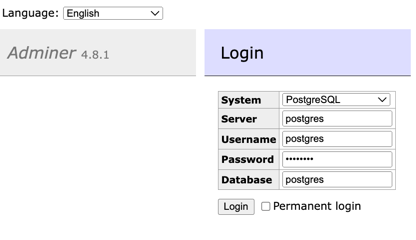
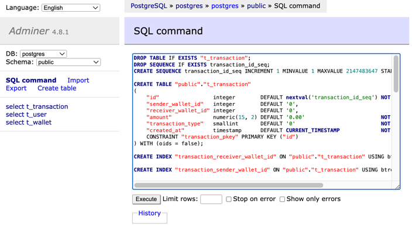
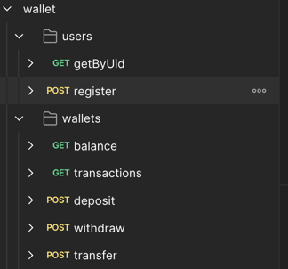

钱包服务
==

> Author: Liu <lightserver.cn@gmail.com>
> 
> Date: 2024-12-01

### 项目概述

本项目旨在实现一个满足特定用户故事的钱包服务，并通过 RESTful API 提供服务。该项目采用 Go 语言和 PostgreSQL 数据库进行开发。

### 环境准备

- Go（Version 1.23.3）
- PostgreSQL
- Docker
- Docker Compose

### 代码结构

代码组织结构如下：

```sh
- app：包含业务逻辑和处理程序，是项目的核心部分
  - controller：处理 HTTP 请求和响应，分发请求并返回服务响应
  - model：定义数据结构和数据库模型
  - repository：处理与数据库的交互，提供数据操作接口
  - request：定义 API 请求的结构体
  - service：实现业务逻辑和规则，调用 repository 进行数据操作
- boot：初始化相关组件
  - boot：初始化启动代码
  - config：加载和解析配置文件
  - db：初始化数据库连接
  - http：初始化 HTTP 服务器
  - log：初始化日志系统
- cmd：包含主应用程序入口点
- config：包含配置文件
  - config.go：配置文件结构定义
  - config.local.yaml：本地配置文件
  - config.yaml：容器配置文件
  - ddl.sql：数据库表结构 DDL
- docker-compose：定义服务及其依赖
  - volumes：数据卷
    - postgres：PostgreSQL 数据卷
    - redis：Redis 数据卷
- dockerfile：构建 Docker 镜像
- pkg：包含可重用的包和实用程序
  - consts：常量定义
  - dal：数据访问层
  - log：自定义日志包
- postman：API 测试接口集合
- router：定义 API 路由
- runtime：运行时配置和脚本
- test：单元测试和集成测试
  - db：数据库相关的测试
```

### 安装和运行

#### 本地运行

1. 设置环境变量：

编辑 `config/config.local.yaml` 文件，设置必要的环境变量。

示例：

```shell
db:
  driver: postgres
  host: 127.0.0.1
  port: 5432
  user: postgres
  password: postgres
  db_name: postgres

db-test:
  driver: postgres
  host: 127.0.0.1
  port: 5432
  user: postgres
  password: postgres
  db_name: test_postgres

redis:
  addr: 127.0.0.1:6379
  password:
  db: 0
```

2. 运行应用程序：

```shell
go run main.go
```

#### 容器化运行

执行以下命令即可

```shell
sh ./run.sh
```

命令包含：
- 构建服务二进制文件
- 创建 `runtime/log` 日志目录
- 创建 `docker-compose/volumes/{postgres,redis}`
- 构建运行环境包含服务（postgres, adminer, redis, redis-commander, golang）

#### 进入接口测试

1. 访问 `http://127.0.0.1:8082/` 登录 pgsql

> 根据 docker-compose/docker-compose.yaml 配置，输入账号密码



2. 选择 `SQL command` 执行，初始化项目数据表结构

> config/config.yaml 配置 db.init_table 默认开启表结构初始化，则不需要构建数据表结构



3. 打开 postman，倒入数据，即可进行测试

> 数据在 postman/wallet.postman_collection.json



4. 需要先注册好两个初始化用户，用于测试使用，POST 请求 http://localhost:8080/api/users 即可。

5. 钱包相关的接口，在文件夹 wallets 上。

### 决策说明

- 语言： 选择 `Go` 是因为其性能、并发特性和强大的标准库。
- 数据库： 选择 `PostgreSQL` 是因为其稳健性、支持 `ACID` 事务和丰富的功能集。
- 内存数据库： 使用 Redis 进行缓存和处理高频数据访问。
- ORM： 根据要求不允许使用 `ORM`，因此使用原始 `SQL` 查询与 `database/sql` 包。
- 日志记录： 使用 `go.uber.org/zap` 包以简化操作。
- 小数处理： 使用 `github.com/shopspring/decimal` 包进行精确的小数运算。

### Linting

项目使用 `golangci-lint` 进行 `linting`。根目录中提供了 `golangci.yaml` 配置文件。运行 linting：

```shell
golangci-lint run --config=.golangci.yaml
```

### 单元测试

单元测试使用 Go 的内置测试包编写。运行测试：

部分情况会出现以下错误，暂未解决，但不影响业务测试

> CreateTestDB returned an error: pq: duplicate key value violates unique constraint "pg_database_datname_index"

```shell
go test ./... -race -cover
```

### Goroutine 泄漏检查

使用 uber-go/goleak 包检查 Goroutine 泄漏。运行泄漏检查：

```shell
go test ./... -race -cover -timeout=30m -v -tags=leakcheck
```

### 花费时间

以下是开发和维护该项目花费的时间预估：

- 需求分析和设计：4小时
- 环境搭建和配置：4小时
- 项目搭建和运行：12小时
- 核心功能实现（包括业务逻辑、数据库交互、API开发）：20小时
- 单元测试和集成测试编写：32小时
- Docker 化和容器编排：8小时
- 文档编写和 README 优化：4小时
- 总计：84小时
